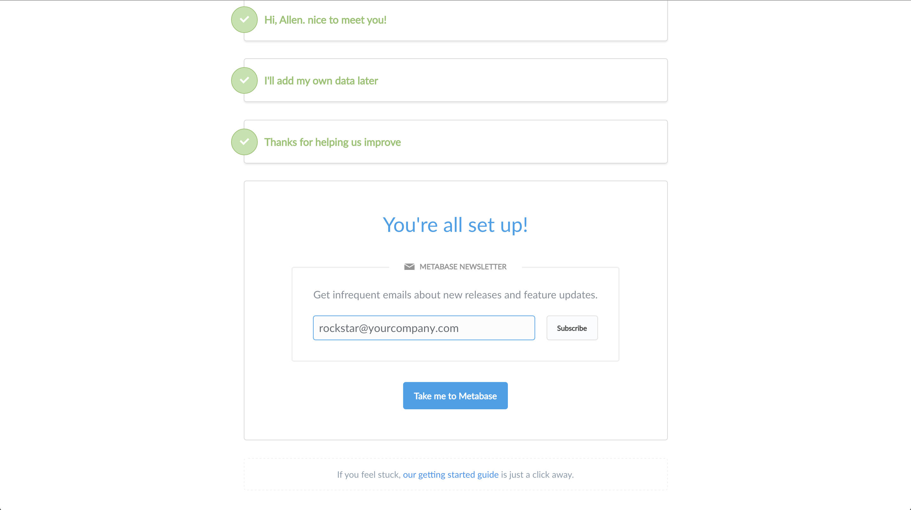

# Setting up Metabase

This guide will help you set up Metabase once you’ve gotten it installed. If you haven’t installed Metabase yet, you can [get Metabase here](http://www.metabase.com/start/).

Start Metabase up for the first time and you’ll see this screen:

Go ahead and click **Let’s get started**.

## Setting up an admin account
The first thing you’ll need to do is set up an admin account. The account you create when you first install Metabase is an admin account by default — handy! If you’ve installed Metabase on a production server, you should be really careful to remember the password for this account since it will be used to add other users, connect to databases, set up email, and more. You can also create additional admin accounts later.

For now, let's just create an account for ourselves to explore Metabase. Type in your info, and when you’re ready to continue, click the **Next** button.

## Gathering your database info
At this point you’ll need to gather some information about the database you want to use with Metabase. We won’t be able to connect to your database without it, but you’d like to deal with all of this later, that’s okay: just click **I’ll add my data later**.

If you’re ready to connect, here’s what you’ll need:

* The **hostname** of the server where your database lives
* The **port** the database server uses
* The **database name**
* The **username** you use for the database
* The **password** you use for the database

If you’re using Heroku, here are [instructions on how to get this information](administration-guide/01-managing-databases.md#heroku-databases). If you’re an Amazon RDS kind of person, you can follow [these instructions](administration-guide/01-managing-databases.md#rds-databases).

If you don't have this information handy, the person responsible for administering the database should have it.

## Connect to your database
Now that you have your database info you can connect to your database. Sweet, sweet data at last. Just go ahead and put your info into this form and click **Next**.

## Usage data preferences
One last quick thing that you’ll have to decide is if it’s okay for us to collect some anonymous info about how you use the product — it helps us a bunch to make Metabase better! Like the box says:
* Metabase never collects anything about your data or question results.
* All collection is completely anonymous.
* Collection can be turned off at any point in your admin settings.

If you’re ready to start using Metabase, go ahead and click **Next**

## Staying in touch
At this point you are all set and ready to use Metabase.  Since we like keeping in touch with our friends we made it easy to sign up for our newsletter (infrequent emails) with a single click!

Once you're done here simply follow the link to **Take me to Metabase**.  And if you decided to skip the newsletter sign-up it's cool, we still like you :)

# Next: Getting started with Metabase
For a quick overview of how to use Metabase, head over to the [Getting Started Guide](getting-started.md).

For information on adding team members, connecting additional databases, configuring Metabase settings, and more, check out the [Admin Guide](./administration-guide/start.md).
